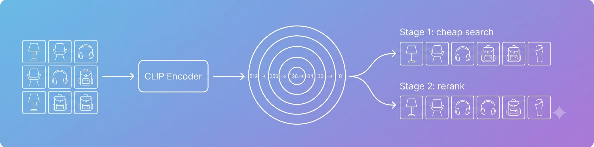
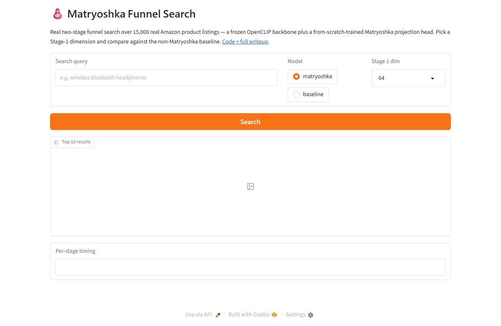
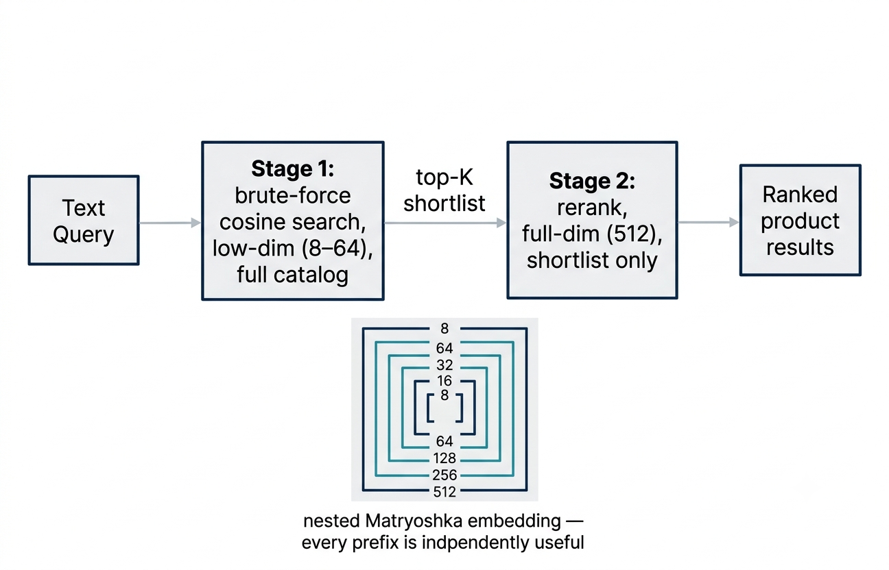
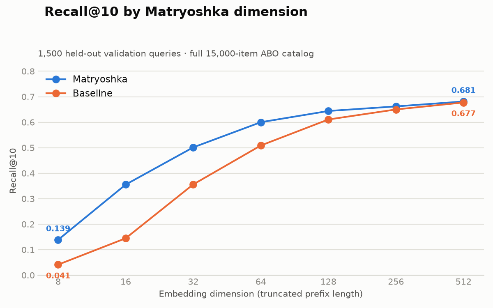
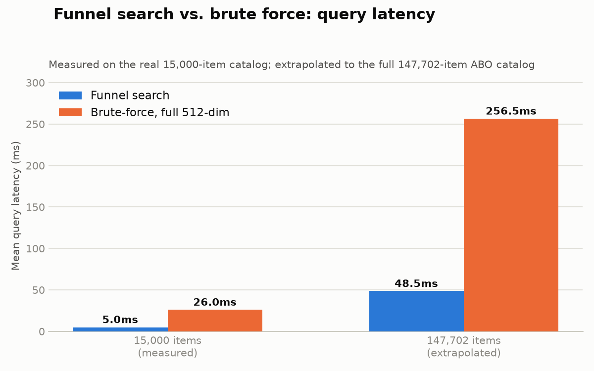

<div align="center">



# 🪆 Matryoshka Funnel Search

### Cross-framework (PyTorch + JAX) reproduction of production-style Matryoshka Representation Learning "funnel search" on Amazon's public product catalog

[](./LICENSE)
[](./pyproject.toml)
[](https://pytorch.org/)
[](https://jax.readthedocs.io/)
[](https://arxiv.org/abs/2205.13147)

**[Overview](#-overview) · [Demo](#-demo) · [Method](#-method) · [Tech Stack](#-tech-stack) · [Quickstart](#-quickstart) · [Status](#%EF%B8%8F-status) · [Results](#-results) · [Citation](#-citation)**

</div>

---

## 📌 Overview

**Can a self-trained Matryoshka model, applied to Amazon's own public
product catalog, reproduce the storage/latency-vs-accuracy tradeoff that
production embedding systems (OpenAI, Voyage AI, Nomic, Google Gemini
embeddings) report at scale — cheaply enough for one person to build in a
few weeks?**

This repo is a from-scratch, cross-framework reproduction of
**Matryoshka Representation Learning (MRL)** — Kusupati et al., NeurIPS 2022
([arXiv:2205.13147](https://arxiv.org/abs/2205.13147)) — applied to a
text-to-image product search system over the
[Amazon Berkeley Objects](https://registry.opendata.aws/amazon-berkeley-objects/)
dataset, benchmarked honestly against retention numbers reported in the
literature. It is a faithful reproduction of an established,
production-adopted technique, not a novelty claim.

## 🎬 Demo

<div align="center">

</div>

Real queries against the real trained model — no mockups. Run it yourself:

```bash
make setup && make demo-web    # browser UI at http://localhost:7860
make demo                      # or the terminal version
```

## 🧠 Method

<div align="center">

</div>

1. A **frozen PyTorch OpenCLIP backbone** (`ViT-B-32`, `openai` weights) encodes product images and text into a shared 512-dim space. Never fine-tuned.
2. A **small trainable JAX/Flax projection head** is trained with the Matryoshka nested-loss trick: contrastive image-text loss is computed independently at every truncation length in `M = {8, 16, 32, 64, 128, 256, 512}` and summed, forcing early dimensions to be independently useful.
3. **Two-stage "funnel search"** — a real, named production pattern (see [Milvus's writeup](https://milvus.io/blog/matryoshka-embeddings-detail-at-multiple-scales.md)), not invented here — searches the full catalog cheaply at low dimension, then reranks only the shortlist at full dimension.

## 🧰 Tech Stack

| | |
|---|---|
| Frozen backbone | PyTorch + OpenCLIP `ViT-B-32` (`openai` weights) |
| Trainable head | JAX + Flax (NNX) + Optax |
| Dataset | [Amazon Berkeley Objects (ABO)](https://registry.opendata.aws/amazon-berkeley-objects/) — **verify the current license on the live page** before any use beyond personal/research/portfolio purposes (sources have disagreed between CC BY-NC 4.0 and CC BY 4.0) |

## ⚡ Quickstart

```bash
git clone https://github.com/kartik1pandey/matryoshka-funnel-search.git
cd matryoshka-funnel-search
make setup     # editable install (torch + jax + dev extras) + pre-commit hooks
make check     # lint, typecheck, test — same as CI
make demo      # interactive query CLI (needs data/checkpoints from the training pipeline)
```

This project intentionally runs two ML frameworks side by side (frozen
PyTorch backbone, trainable JAX head) — install the `torch` and `jax` extras
independently if you hit a dependency conflict between them. JAX GPU support
on native Windows is limited; use WSL2 or a cloud GPU instance for training,
CPU is fine for development and the demo path.

## 📁 Repo Layout

```
src/matryoshka_search/
├── data/     # ABO subset download + deterministic selection
├── model/    # frozen PyTorch backbone + trainable JAX Matryoshka head
├── train/    # Matryoshka nested loss + Optax training loop
├── eval/     # retention metrics, funnel search, latency benchmarks
└── demo/     # interactive query CLI
tests/        # unit tests (CI-enforced)
```

## 🗺️ Status

✅ Weeks 1–4 core work complete: real ABO data (15,000 products), real frozen
OpenCLIP embeddings, a real trained Matryoshka head + baseline, a full
funnel-search evaluation (Recall@K/nDCG@K at every dimension, retention vs.
literature, real latency), a working interactive query demo (`make demo`),
and a cost projection to the full 147,702-item ABO catalog — see
[Results](#-results) below. Remaining: the final writeup pass.

## 📊 Results

Measured on 1,500 held-out validation queries against the real cached
embeddings for all 15,000 sampled ABO products (Recall@10, retention vs. the
512-dim reference point):

<div align="center">

</div>

| Dimension | Recall@10 (MRL) | Recall@10 (baseline) | Retention (MRL) | Retention (baseline) |
|---|---|---|---|---|
| 512 | 0.681 | 0.677 | 100% (reference) | 100% (reference) |
| 256 | 0.662 | 0.650 | 97.2% | 96.0% |
| 128 | 0.644 | 0.611 | 94.5% | 90.2% |
| 64  | 0.600 | 0.509 | 88.1% | 75.1% |
| 32  | 0.501 | 0.356 | 73.6% | 52.6% |
| 16  | 0.355 | 0.145 | 52.2% | 21.4% |
| 8   | 0.139 | 0.041 | 20.4% | 6.1% |

nDCG@10 (same setup):

| Dimension | nDCG@10 (MRL) | nDCG@10 (baseline) |
|---|---|---|
| 512 | 0.438 | 0.437 |
| 256 | 0.424 | 0.416 |
| 128 | 0.405 | 0.380 |
| 64  | 0.379 | 0.314 |
| 32  | 0.293 | 0.198 |
| 16  | 0.186 | 0.078 |
| 8   | 0.068 | 0.021 |

**256-dim retention (97.2%) lands inside the 94–98% range reported by
independent academic benchmarking of production embedding models** — see
[docs/08_results.md](./docs/08_results.md) for funnel-search-specific
retention and an honest discussion of where the gap to the literature
widens at aggressive truncation, and why.

**Funnel search vs. brute force** (Stage 1 low-dim + Stage 2 full-dim
rerank; latency measured directly on the real 15,000-item catalog by
`scripts/cost_projection.py` — see chart below): **~5.2x faster** (26.0ms →
5.0ms per query) at `low_dim=64`, for a 1.5-point Recall@10 cost (98.5%
funnel retention vs. brute force, a separate quality-only measurement from
`scripts/evaluate.py`, unaffected by wall-clock timing). At a more
aggressive `low_dim=16`, the MRL model still recovers 93.6% of brute-force
recall — the baseline collapses to 62% — which is the specific scenario this
whole project exists to demonstrate. (`scripts/evaluate.py` runs its own,
separate latency benchmark too, for a different question — is latency the
same regardless of which model produced the embeddings — see
[docs/08_results.md](./docs/08_results.md); its absolute numbers differ
slightly from the ones here, which is expected wall-clock noise between two
independent benchmark runs, not a discrepancy — this README only ever
quotes the `cost_projection.py` numbers, matching the chart.)

<div align="center">

</div>

**Cost projection to the full 147,702-item ABO catalog** (extrapolated from
the same 15,000-item measurement above, not separately measured — see
[docs/08_results.md](./docs/08_results.md) for the full breakdown and
stated scaling assumptions): brute-force full-dim search extrapolates to
~256.5ms/query vs. ~48.5ms for funnel search (~5.3x at that scale). A plain
full-dim brute-force search would cross a 100ms interactive-latency budget at
~57,600 items — below this catalog's size — but Stage 1 as actually built
here (low-dim, not full-dim) has its own much higher viability threshold,
~304,700 items, comfortably past 147,702. Storage: one 512-dim float32
vector/item scales to 302.5MB at full catalog size; Stage 1's low-dim view
is a free slice of that same vector, so a system storing a **separate**
low-dim index alongside it would need 1.125x more storage for no quality
benefit.

## 📚 Citation

This project reproduces, and does not claim to improve on, the following work:

```bibtex
@inproceedings{kusupati2022matryoshka,
  title={Matryoshka Representation Learning},
  author={Kusupati, Aditya and Bhatt, Gantavya and Rege, Aniket and Wallingford, Matthew and Sinha, Aditya and Ramanujan, Vivek and Howard-Snyder, William and Chen, Kaifeng and Kakade, Sham and Jain, Prateek and Farhadi, Ali},
  booktitle={Advances in Neural Information Processing Systems (NeurIPS)},
  year={2022}
}
```

## 📄 License

Code: [MIT](./LICENSE). The ABO dataset has its own license — verify the
current terms on the [registry page](https://registry.opendata.aws/amazon-berkeley-objects/)
before relying on either.
